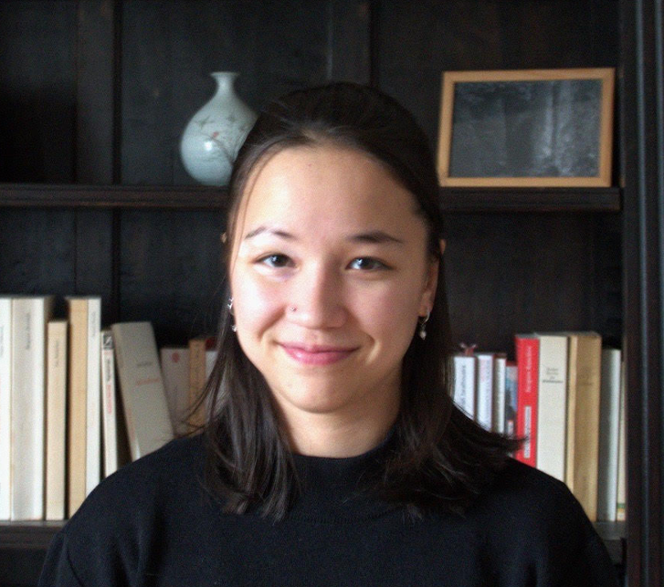

Phd student in [HeKA](https://heka.gitlabpages.inria.fr), supervized by [Anne-Sophie Jannot](https://scholar.google.fr/citations?user=2tpUwgEAAAAJ&hl=fr&oi=ao), [Nicolas Jay](https://site-23068d.gitlabpages.inria.fr/members/permanents/nicolas-jay.html), [Nicolas Garcelon](https://scholar.google.fr/citations?user=pZsgtewAAAAJ&hl=fr&oi=sra) and [Aurelie Bannay](https://members.loria.fr/ABannay/). My PDH is part of the [M4DI project](https://m4di.univ-amu.fr), funded by the PEPR [Santé Numérique](https://pepr-santenum.fr).

I'm working on the development of a generic method to describe the care pathways of patients with rare diseases from French National Health Data System i.e french claim record.

<pre class="ascii-art">
⠀⠀⠀⠀⠀⠀⠀⠀⠀⠀⠀⠀⠀⣀⣀⣀⣠⣠⣀⣀⣀⣀⠀⠀⠀⠀⠀⠀⠀⠀⠀⠀⠀⠀⠀⠀⠀⠀⠀⠀⠀⠀⠀⠀⠀⠀⠀⠀⠀⠀
⠀⠀⠀⠀⠀⠀⠀⠀⠀⢀⣀⣴⣿⣿⡿⣿⡟⠛⠛⠛⠉⠁⠀⠀⠀⠀⠀⠀⠀⠀⠀⠀⠀⠀⠀⠀⠀⠀⠀⠀⠀⠀⠀⠀⠀⠀⠀⠀⠀⠀
⠀⠀⠀⠀⠀⣠⣴⣶⣿⣿⣿⣿⣿⣿⣿⣿⣿⣿⣷⣶⣦⠀⠀⠀⠀⠀⠀⠀⠀⠀⠀⠀⠀⠀⠀⠀⠀⠀⠀⠀⠀⠀⠀⠀⠀⠀⠀⠀⠀⠀
⠀⠀⠀⣀⣾⣿⣿⣿⣿⣿⣿⣿⣿⣄⠀⠀⠉⠉⠉⠉⠀⠀⠀⠀⠀⠀⠀⠀⠀⠀⠀⠀⠀⠀⠀⠀⠀⠀⠀⠀⠀⠀⠀⠀⠀⠀⠀⠀⠀⠀
⠀⠀⠀⠹⣿⣿⣿⣿⣿⣿⣿⣿⣿⣿⣿⣿⣷⣶⣶⣶⣶⣶⣶⣦⣴⣶⣶⣶⣿⣿⣿⣿⣿⣿⣶⣶⣿⣿⣶⣄⠀⠀⠀⠀⠀⠀⠀⠀⠀⠀
⠀⠀⠀⠀⠈⠉⠙⢿⣿⣿⣿⣿⣿⣿⣿⣿⣿⣿⣿⣿⣿⣿⣿⣿⣿⣿⣿⣿⣿⣿⣿⣿⣿⣿⣿⣿⣿⡿⠟⠋⠀⠀⠀⠀⠀⠀⠀⠀⠀⠀
⠀⠀⠀⠀⠀⠀⠀⠀⢻⣿⣿⣿⣿⣿⣿⣿⣿⣿⣿⣿⣿⣿⣿⣿⣿⣿⣿⣿⣿⣿⣿⣿⣿⣿⣿⣿⣿⣷⡀⠀⠀⠀⠀⠀⠀⠀⠀⠀⠀⠀
⠀⣀⣦⣤⣶⣶⣶⣶⣿⣿⣿⣿⣿⣿⣿⣿⣿⣿⣿⣿⣿⣿⣿⣿⣿⣿⣿⣿⣿⣿⣿⣿⣿⣿⣿⣿⣿⣿⣿⣦⣤⣤⣄⠀⠀⠀⠀⠀⠀⠀
⠸⣿⡿⣟⣻⣯⣭⣿⣿⣿⣿⣿⣿⣿⣿⣿⣿⣿⣿⣿⣿⣿⣿⣿⣿⡿⠿⠛⠛⠛⠛⠻⣿⣿⣿⣿⣿⣿⣿⣿⣿⣿⣿⣿⣷⣤⠀⠀⠀⠀⠀
⠀⠀⣾⣿⣿⠿⠛⠉⠉⠉⠉⠉⠉⠉⠉⠙⠛⠛⠛⠛⠛⠛⠋⠁⠀⠀⠀⠀⠀⠀⠀⠈⠙⢿⣿⣿⣿⣿⣿⣿⣿⣾⣿⠿⢿⣿⣶⣶⣶⣄
⠀⠀⠀⠉⠀⠀⠀⠀⠀⠀⠀⠀⠀⠀⠀⠀⠀⠀⠀⠀⠀⠀⠀⠀⠀⠀⠀⠀⠀⠀⠀⠀⠀⠀⠀≉≉≉≉≉≉⠙⠻⢿⣷⣄⠈≉≉⠙⛛⠃
⠀⠀⠀⠀⠀⠀⠀⠀⠀⠀⠀⠀⠀⠀⠀⠀⠀⠀⠀⠀⠀⠀⠀⠀⠀⠀⠀⠀⠀⠀⠀⠀⠀⠀⠀⠀⠀⠀⠀⠀⠀⠀⠀⠀⠀⠀⠙⠻⣿⣶⣦⠀⠀
⠀⠀⠀⠀⠀⠀⠀⠀⠀⠀⠀⠀⠀⠀⠀⠀⠀⠀⠀⠀⠀⠀⠀⠀⠀⠀⠀⠀⠀⠀⠀⠀⠀⠀⠀⠀⠀⠀⠀⠀⠀⠀⠀⠀⠀⠀⠙⠋⠀⠀
</pre>

